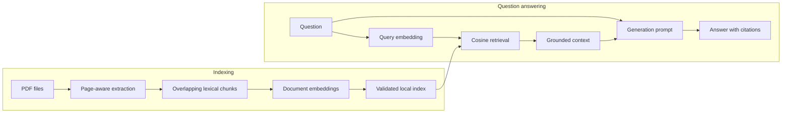

# Google SWE RAG

[](https://github.com/haagjjan/google-swe-rag/actions/workflows/ci.yml)
[](https://www.python.org/)
[](LICENSE)

A transparent, framework-free retrieval-augmented generation (RAG) pipeline
for asking grounded questions about text-based PDFs. The reference use case is
*Software Engineering at Google*, but the implementation works with any PDF
collection that has an extractable text layer.

I built this project voluntarily as part of my AI-engineering studies. The goal
was to implement and test the core RAG mechanics directly - document parsing,
chunking, embeddings, persistence, retrieval, prompt construction, and source
attribution - before adopting higher-level frameworks such as LangChain.

> This repository contains code only. It does not distribute the book, chapter
> PDFs, extracted book text, or a generated vector index. Users must provide
> documents they are authorized to process.

## What the project demonstrates

- Recursive, deterministic PDF discovery and page-aware text extraction
- Stable overlapping lexical-token chunks with source provenance
- Batched document embeddings and separate query embeddings through Google AI
- Atomic persistence of vectors and validated metadata in a local NumPy index
- Cosine-similarity retrieval with deterministic tie handling
- Grounded answer generation with inline source labels and page references
- Explicit insufficient-evidence behavior
- Installable Python packaging and a small command-line interface
- 42 offline tests that mock the model-provider boundary
- Clear failure messages without exposing credentials

The implementation intentionally avoids LangChain and hosted vector databases.
That keeps the data flow inspectable and makes the design decisions visible.

## Architecture



Indexing and question answering are separate operations. Documents are embedded
once and reused; each question requires only a query embedding, local retrieval,
and one generation request.

See [Architecture](docs/ARCHITECTURE.md) for component boundaries, data flow,
index invariants, and trust boundaries.

## Quick start

### Prerequisites

- Python 3.11 or newer
- A Google AI Studio API key
- At least one text-based PDF you are authorized to process

### Installation

```bash
git clone https://github.com/haagjjan/google-swe-rag.git
cd google-swe-rag

python3 -m venv .venv
source .venv/bin/activate
python -m pip install --upgrade pip
python -m pip install -e ".[dev]"

cp .env.example .env
```

Add the API key to the untracked `.env` file:

```dotenv
GOOGLE_API_KEY=your_google_ai_studio_key
```

Place one or more PDFs below `data/pdfs/`, then build the index:

```bash
swe-google-rag index
```

Ask a question:

```bash
swe-google-rag ask "What are the main differences between programming and software engineering?"
```

Example output shape:

```text
Answer:

<grounded answer with [Source 1] citations>

Retrieved sources:

[Source 1] example.pdf, page 1, score=0.7447
```

The exact answer and scores depend on your documents, models, and
configuration. Read the [User manual](docs/USER_MANUAL.md) for the full setup,
configuration reference, operating workflow, and troubleshooting guide.

## How it works

### Indexing

1. Discover PDF files recursively and in stable path order.
2. Extract text while preserving physical page numbers.
3. Split each page into deterministic overlapping chunks.
4. Embed chunks in bounded batches using the document retrieval task type.
5. Validate vector counts and dimensions.
6. Atomically save vectors, provenance, and embedding configuration.

### Question answering

1. Validate and embed the complete question using the query retrieval task type.
2. Load and validate the stored index.
3. Rank chunks by cosine similarity.
4. Format the highest-ranked excerpts with filenames and page numbers.
5. Ask the generation model to answer only from those excerpts.
6. Return the answer together with the retrieved source records and scores.

## Verification

Run the offline suite without API calls or quota usage:

```bash
python -m pytest -q
```

Expected result:

```text
42 passed
```

The completed reference run used two locally held chapter PDFs:

| Check | Verified result |
| --- | ---: |
| PDFs discovered | 2 |
| Pages extracted | 37 |
| Chunks indexed | 59 |
| Embedding dimension | 768 |
| Relevant question | Grounded answer with page citations |
| Unrelated question | Explicit insufficient-evidence response |

These reference documents and their derived index are intentionally not part
of the repository. See [Testing and evaluation](docs/TESTING.md) for what the
automated tests prove and what still requires a larger evaluation dataset.

## Project structure

```text
google-swe-rag/
├── .github/workflows/ci.yml
├── data/
│   ├── pdfs/                 # Local input documents; ignored by Git
│   └── vector_store/         # Generated index; ignored by Git
├── docs/
│   ├── ARCHITECTURE.md
│   ├── DESIGN_DECISIONS.md
│   ├── DEVELOPMENT_LOG.md
│   ├── TESTING.md
│   └── USER_MANUAL.md
├── src/swe_google_rag/
│   ├── chunking.py
│   ├── config.py
│   ├── documents.py
│   ├── embeddings.py
│   ├── generation.py
│   ├── indexing.py
│   ├── main.py
│   ├── rag.py
│   ├── schemas.py
│   └── vector_store.py
├── tests/
├── .env.example
├── LICENSE
├── pyproject.toml
└── README.md
```

## Engineering decisions

Several constraints are deliberate:

- **No orchestration framework:** the project exposes each RAG step directly.
- **Lexical tokenization:** Google does not provide a local tokenizer for the
  embedding model, so chunk boundaries use a documented deterministic
  approximation.
- **Local NumPy index:** appropriate for a single-user learning-scale dataset;
  not presented as a production vector database.
- **Dense retrieval only:** useful as a clear baseline before hybrid search or
  reranking.
- **Full rebuilds:** simple and predictable for small document collections.

The complete rationale is recorded in
[Design decisions](docs/DESIGN_DECISIONS.md).

## Security and data handling

- API keys belong only in `.env`, which is ignored by Git.
- Source PDFs and generated indices are ignored by Git.
- Document chunks are sent to Google's embedding API during indexing.
- A question and its retrieved excerpts are sent to Google's generation API.
- Vectors and source metadata are stored locally in `index.npz`.
- Prompt instructions explicitly tell the model to ignore instructions found
  inside retrieved source text.

Review [Security](SECURITY.md) before processing confidential documents.

## Deliberate limitations

- No OCR for scanned or image-only PDFs
- Lexical tokens are not provider billing tokens
- No incremental indexing
- Dense cosine retrieval only; no threshold, keyword fallback, or reranker
- No automatic section-title extraction
- No conversation history or graphical interface
- Local storage is not designed for large or concurrent workloads
- Grounding is prompted and tested at the boundary, not formally guaranteed

## Documentation

- [User manual](docs/USER_MANUAL.md)
- [Architecture](docs/ARCHITECTURE.md)
- [Design decisions](docs/DESIGN_DECISIONS.md)
- [Testing and evaluation](docs/TESTING.md)
- [Development log](docs/DEVELOPMENT_LOG.md)
- [Contributing](CONTRIBUTING.md)
- [Security](SECURITY.md)

## Attribution and disclaimer

*Software Engineering at Google* is written by Titus Winters, Tom Manshreck,
and Hyrum Wright and published by O'Reilly Media. This independent educational
project is not affiliated with or endorsed by Google or O'Reilly Media.

The MIT license applies to this repository's source code and documentation. It
does not grant rights to third-party books or documents processed by the
software.
