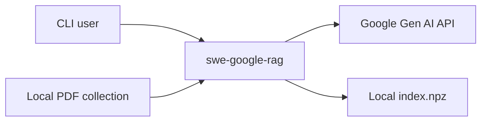
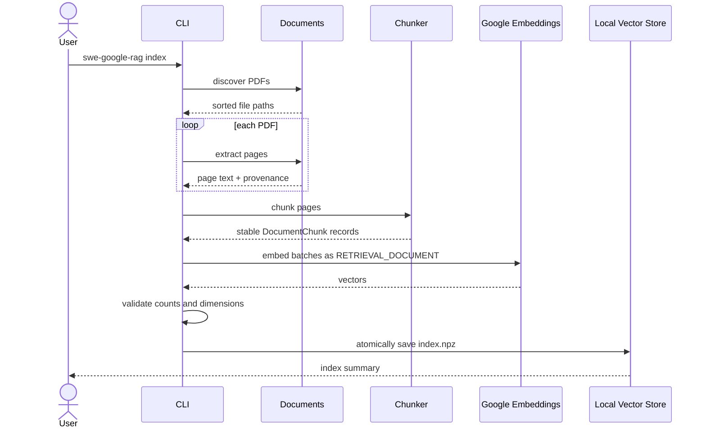
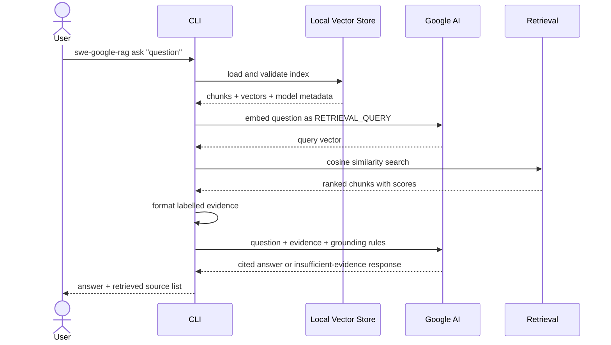
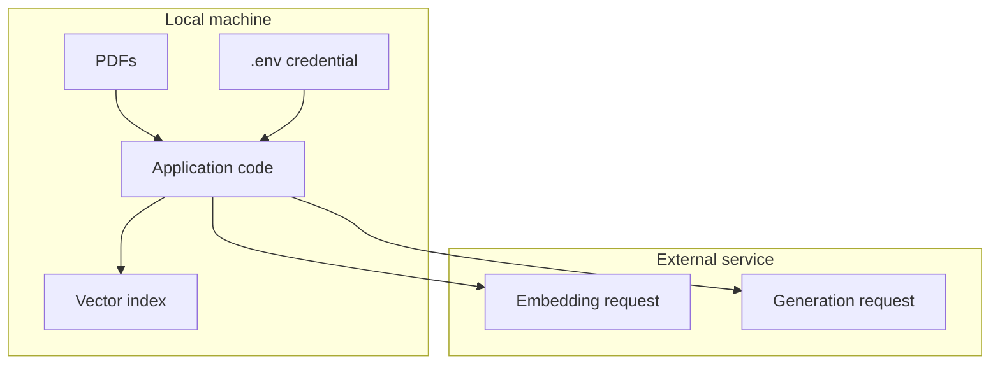

# Architecture

This document describes the implemented system, not an aspirational production
architecture. The project is intentionally small enough that every RAG stage
can be read, tested, and replaced independently.

## System context

The CLI and vector index run locally. Embedding and generation are remote model
operations. The application has no hosted backend, authentication system,
multi-user storage, or background worker.

## Goals

- Make the complete retrieval path inspectable.
- Preserve page-level provenance through every stage.
- Fail clearly when configuration, documents, vectors, or provider responses
  violate expected contracts.
- Avoid sending API requests during the default test suite.
- Keep secrets, input documents, and generated indices out of Git.

## Non-goals

- Production-scale vector search
- OCR or document-layout understanding
- Conversational memory
- Multi-user access
- Provider independence
- Autonomous or agentic behavior

## Indexing sequence

Index creation is a full rebuild. A temporary file is flushed and then moved
over the existing index so a partial write does not become the active index.

## Question-answering sequence

## Component boundaries

| Module | Responsibility | Important boundary checks |
| --- | --- | --- |
| `config.py` | Load environment settings and resolve paths | Required values, positive integers, overlap bounds, secret-safe errors |
| `documents.py` | Discover PDFs and extract page text | Directory/file validation, extension, encryption, page-specific errors |
| `chunking.py` | Create overlapping lexical chunks | Stable IDs, deterministic boundaries, page provenance |
| `embeddings.py` | Call the Google embedding API | Empty inputs, batching, response count, dimension, provider errors |
| `vector_store.py` | Persist and search vectors | Format version, metadata types, matrix shape, finite values, unique IDs |
| `generation.py` | Format evidence and generate an answer | Source labels, empty context, prompt-injection instruction, provider errors |
| `indexing.py` | Coordinate the offline indexing path | Empty corpus/chunks/vectors, saved build summary |
| `rag.py` | Coordinate the query-time RAG path | Stored/configured model compatibility, query dimension |
| `main.py` | Expose the CLI | Argument parsing and concise operator-facing failures |

## Domain records

The pipeline passes immutable dataclasses between stages:

- `ExtractedPage`: source path, physical page number, extracted text, section
- `DocumentChunk`: stable ID, text, filename, page, section, metadata
- `RetrievedChunk`: a document chunk plus cosine-similarity score
- `RagAnswer`: generated text plus the retrieved source records
- `IndexBuildResult`: document/page/chunk counts, dimension, and output path

These records keep model-provider objects from leaking through the application.

## Stored index

`data/vector_store/index.npz` contains:

- a two-dimensional `float32` embedding matrix;
- UTF-8 JSON metadata encoded as a byte array;
- chunk content and provenance;
- the embedding model and vector dimension;
- the chunk count and index format version.

The loader treats the file as untrusted input. It checks required arrays,
metadata structure, vector shape, finite numeric values, and unique chunk IDs
before returning data to retrieval.

## Retrieval

The current retriever calculates cosine similarity between the query vector and
every stored document vector. This exact linear scan is easy to verify and is
appropriate for the small reference corpus. Equal scores retain original index
order for deterministic results.

This is a baseline, not a claim that dense top-k retrieval is universally
optimal. A larger system would evaluate metadata filtering, keyword retrieval,
hybrid ranking, reranking, thresholds, and approximate nearest-neighbor indices.

## Grounding and citations

Retrieved chunks are formatted as labelled excerpts containing filename, page,
optional section, and text. The system instruction requires the model to:

- use only supplied excerpts;
- cite claims using `[Source N]` labels;
- ignore instructions inside source material;
- return a fixed response when the evidence is insufficient.

This reduces common failure modes but cannot mathematically guarantee factual
grounding. Citation correctness still needs evaluation against labelled cases.

## Trust boundaries

Document chunks cross the network during indexing. Questions and retrieved
excerpts cross the network during answering. The repository being local does
not make document processing offline or private by default.

## Scaling path

If the corpus or user count grows, likely changes are:

1. Replace the compressed local index with a database or vector store.
2. Add document fingerprints and incremental indexing.
3. Add metadata filters and hybrid retrieval.
4. Introduce a reranker and a measured relevance threshold.
5. Store document-level access permissions and enforce them before retrieval.
6. Run API and indexing work behind a service boundary with authentication.
7. Add tracing, cost monitoring, and an evaluation pipeline.

Those changes are intentionally outside this repository's current scope.
